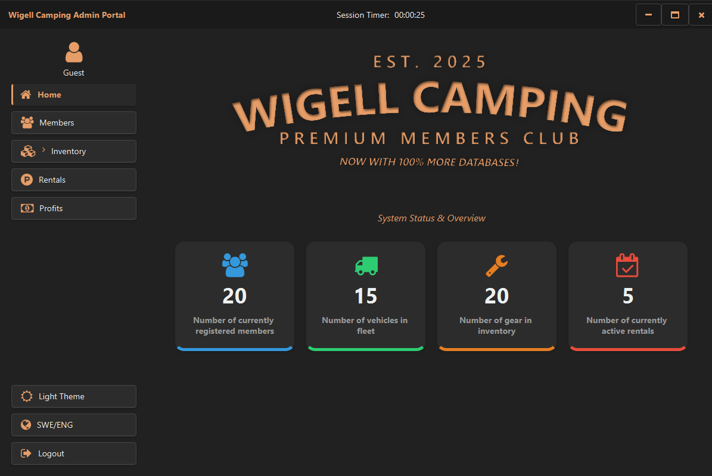
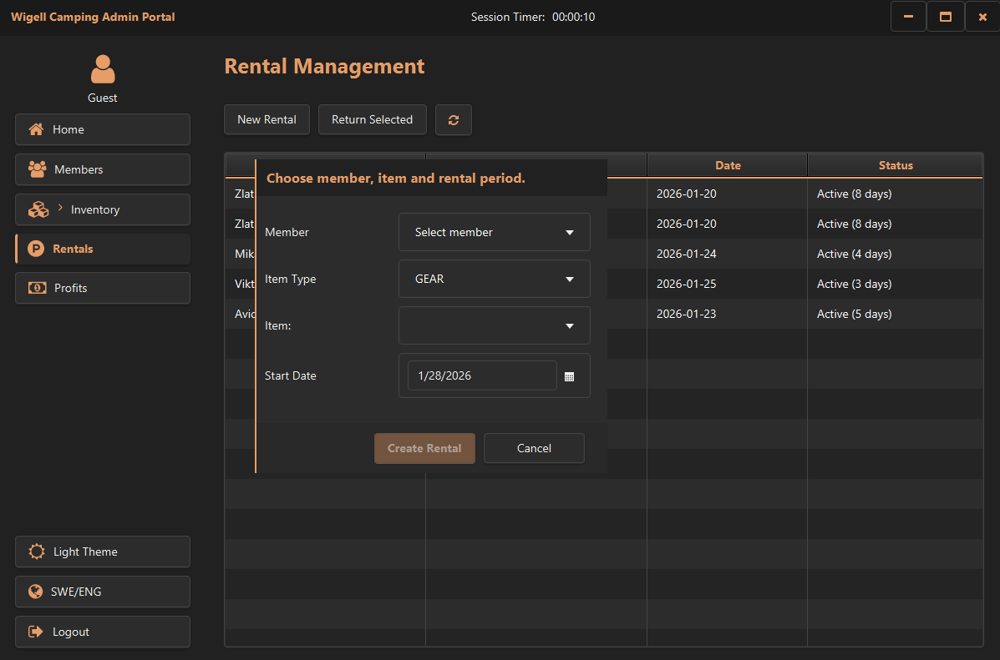
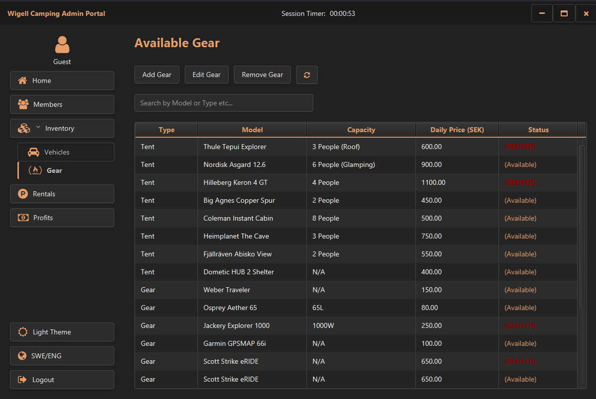
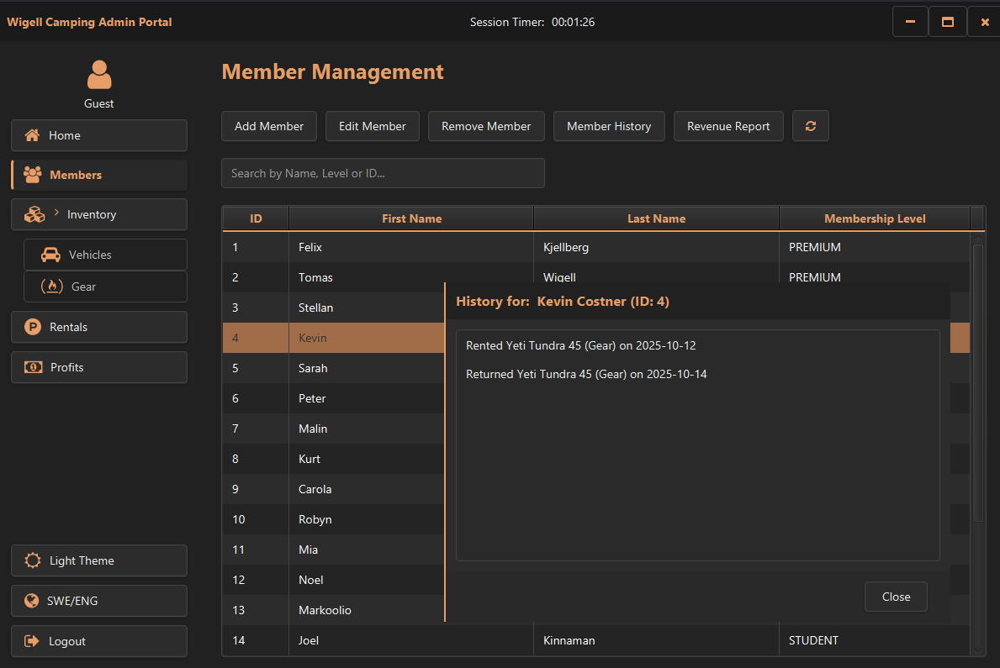
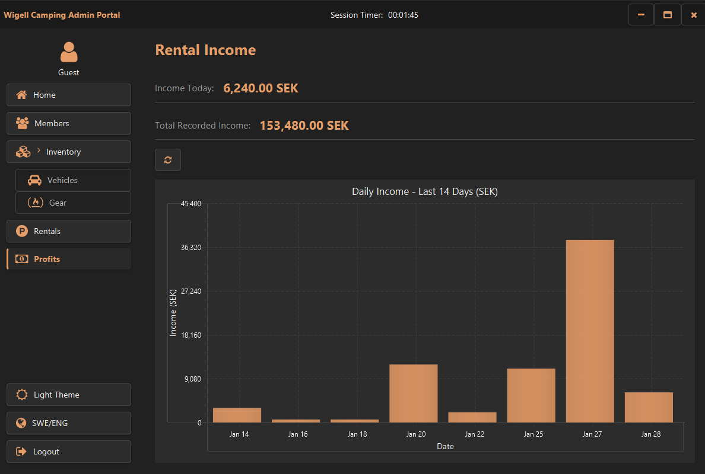
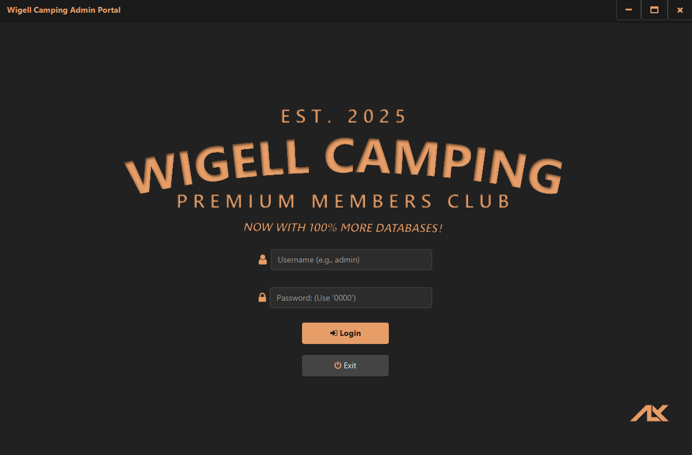

# Wigell Camping DB


A comprehensive enterprise rental management system designed to modernize the camping equipment leasing workflow. It transitions from legacy flat-file storage to a robust **Relational Database** architecture, offering **dynamic pricing strategies**, **member history tracking**, automated profit calculation, and a responsive, localized user interface.

---

## 📸 Interface

### Dashboard & Rentals
| Home Dashboard | New Rental Wizard |
|:---:|:---:|
|  |  |
| *Real-time availability & Status Overview* | *Streamlined Checkout with Dynamic Pricing* |

### Inventory & Management
| Inventory Grid | Member Administration |
|:---:|:---:|
|  |  |
| *Filterable Equipment & Vehicle Tracking* | *Member Tiers & Rental History* |

<details>
<summary><b>View Advanced Features</b></summary>
<br>

| Financial Reporting | Dark Mode UI |
|:---:|:---:|
|  |  |
| *Visualized Profit Analysis over Time* | *Themed CSS for Low-Light Environments* |

</details>

---

## ✨ Key Features

* **Enterprise Persistence (New):** A complete migration to **MySQL** via **Hibernate ORM**, replacing legacy JSON handling for ACID-compliant data integrity.
* **Repository Pattern:** Decoupled data access layer allowing for modular maintenance and testability of Entities (`Members`, `Vehicles`, `Gear`, `Tents`).
* **Dynamic Pricing Engine:** Implements the **Strategy Pattern** to calculate costs based on membership tiers:
    * **Premium:** 24/7 support and priority booking.
    * **Student:** Adjusted rates for budget-friendly rentals.
    * **Standard:** Base market rates.
* **Smart History Logging:** Automatically tracks rental events in the `member_history` table, utilizing cascading integrity for robust audit trails.
* **Internationalization (i18n):** Native support for English and Swedish (`sv_SE`), instantly switchable within the application.
* **Responsive UI:**
    * **Theming:** Toggle between Light and Dark themes (`.css` styled).
    * **Feedback:** Instant validation for dates, stock availability, and member status.
* **Polymorphic Inventory:** Handles diverse item types (Luxury Motorhomes vs. Simple Tents) using a "Table-per-Concrete-Class" database strategy.

---

## 🛠️ Technical Architecture

The application implements a layered **Service-Repository** architecture to ensure separation of concerns.

* **Dependency Injection:** A custom `ServiceContainer` manages the lifecycle of services and repositories, removing hard dependencies.
* **Hibernate ORM:** Annotated Entities (`@Entity`, `@Table`) map Java objects directly to SQL, handling complex relationships and lazy loading.
* **JavaFX 21:** Built strictly with programmatic JavaFX (No FXML) for maximum performance and type safety.
* **Database Seeding:** Automatic `schema.sql` and `data.sql` execution ensures the environment is production-ready on the first launch.
* **Technology Stack:** Java 21 (Modern Syntax), JUnit 5 (Testing), MySQL Connector, Ikonli (Icons).

---

## 🚀 Getting Started

### Prerequisites
1.  Ensure **MySQL Server** is running locally on port `3306`.
2.  Create a database named `wigell_camping_members_club`.

### Configuration
Modify `src/main/resources/hibernate.properties` if your credentials differ:
```properties
hibernate.connection.username=root
hibernate.connection.password=YOUR_PASSWORD
```

---

## 📜 License

Distributed under the **MIT License**. Free for personal and commercial use.

---

<p align="center">
  <b>Developed by</b><br>
  <br>
  Copyright (c) 2026 Alexander Nilsson
</p>
